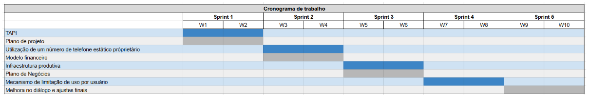
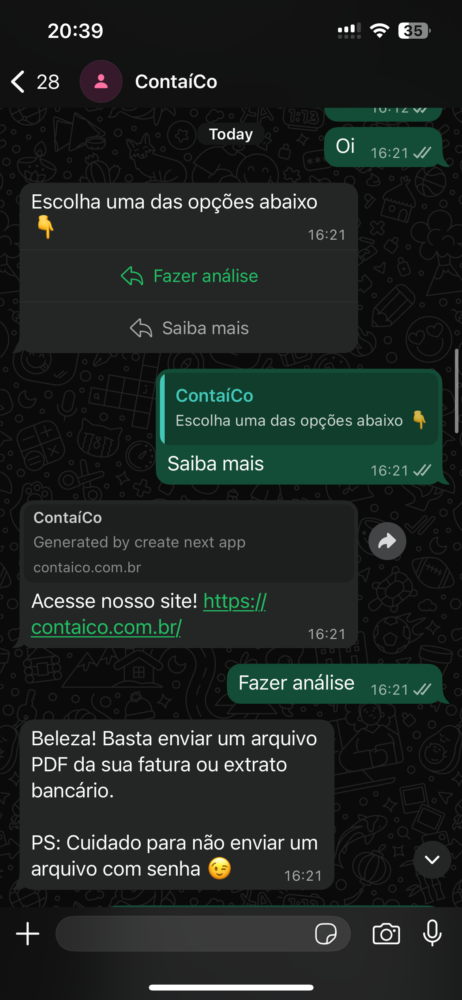
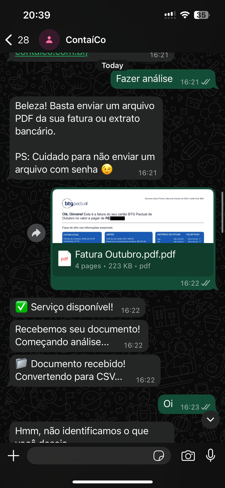
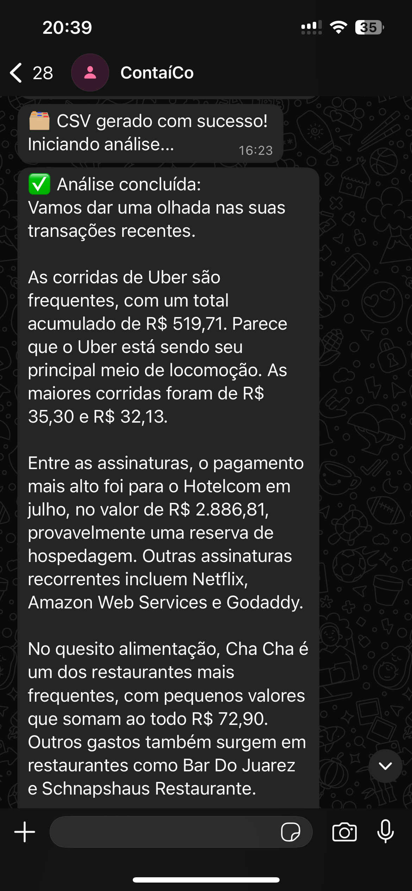

# Public Report

 

  

<h4 align="center">Giovana Lisbôa Thomé   Computer Science   Class of 2025   2025-1B-T02-G56</h4>

 

- [Public Report](#public-report)
  - [Introduction](#introduction)
  - [Developed artifacts](#developed-artifacts)
    - [Sprint 1: TAPI and Project Plan](#sprint-1-tapi-and-project-plan)
    - [Sprint 2: Financial Model and Static Phone Number](#sprint-2-financial-model-and-static-phone-number)
    - [Sprint 3: Productive Environment and Business Plan](#sprint-3-productive-environment-and-business-plan)
    - [Sprint 4: Usage Limit Mechanism and Official Phone Number](#sprint-4-usage-limit-mechanism-and-official-phone-number)
    - [Sprint 5: Last adjustments and public report](#sprint-5-last-adjustments-and-public-report)

## Introduction 

This document provides a clear roadmap of the developments carried out during the 2A module of the 2025 academic year, which spanned a duration of 10 weeks.

Students were encouraged to develop final projects aligned with one of three career tracks: academic, corporate, or entrepreneurial. This project followed the entrepreneurial path, which focuses on creating a product or solution with a computing core and building a business around it.

The idea emerged from a relevant context in Brazil, where financial literacy remains low—only 35% of the population demonstrates basic knowledge of financial concepts (OECD, 2020)—and complex financial products often contribute to over-indebtedness. Managing personal finances is also a repetitive and time-consuming task, and traditional financial apps are not always as practical or engaging as a simple message-based interaction. Given the high penetration of messaging platforms like WhatsApp—installed on over 98% of smartphones in the country (DataReportal, 2024)—there is a clear opportunity to deliver accessible and effective financial guidance through a more familiar and user-friendly format.

This module was closure to the final integration with the Meta Cloud API (WhatsApp API), witch allowed the final development and deployment of the entire infrastructure.

## Developed artifacts

### Sprint 1: TAPI and Project Plan

Both documents were necessary to define the module's scope and progress tracking throughout the ten-week module. The main artifacts were the following:

### Sprint 2: Financial Model and Static Phone Number

This sprint delivered the provisioning pathway for a static private WhatsApp number via the Meta Cloud API and the first complete financial model for the venture. The number +55 11 91023-1956 was designated as the production line and submitted for Meta’s review; after feedback, all compliance corrections were implemented and the LinkedIn company page was provided as the required public presence. Evidence of submission and revision is documented. These steps finalize the legal and technical groundwork to enable a stable, reusable messaging endpoint for subsequent integration and go-to-market experiments.

In parallel, we built a bottom-up cost stack and a usage-based variable cost model for AI calls. Using an assumption of 30 requests/user/month, we derived the closed-form break-even and quantified thresholds: ~53 users at R$ 10, ~33 at R$ 15, and ~24 at R$ 20. Complementary revenue scenarios (subscription and pay-per-use), unit contribution margins, and pricing for target margins were also produced, providing clear guidance for pricing strategy, capacity planning, and user-acquisition targets.

### Sprint 3: Productive Environment and Business Plan

This sprint established the productive environment end to end and advanced the business plan to a first public version. On the technical front, the domain contaico.com.br was configured to point to the EC2 instance, the marketing website was developed and deployed ([contaico.com.br](https://contaico.com.br)), and the core services—MessageManager and AInalytics—were provisioned and verified running. To resolve Meta’s Business Portfolio compliance, a dedicated website and a new Business Manager (ContaíCo) were submitted; as a result, the phone number was approved for permanent use. A permanent token was issued and the webhook configured, leaving the platform ready for controlled tests.

In parallel, the Business Plan (v1, 2025-09-12) was drafted with a clear Executive Summary, Mission–Vision–Values, governance (partners’ roles), legal structure (LTDA, CNPJ), and initial funding sources, defining positioning and differentiation versus incumbent apps and banks’ digital solutions. The only technical blocker at the end of the sprint was a last-minute registration error when finalizing the permanent number linkage; once cleared, the roadmap shifts from infrastructure enablement to service quality—improving the accuracy of financial analyses, refining user flows, and incrementally adding features aligned with the go-to-market plan.

### Sprint 4: Usage Limit Mechanism and Official Phone Number

Sprint 4 focused on implementing the user usage limit mechanism and finalizing the Meta API integration. The limit system was successfully developed and deployed, allowing the platform to track and restrict user trials through the messaging flow. At the same time, compliance adjustments were made to meet Meta’s requirements, including the creation and publication of a privacy policy page. After several failed attempts with pre-paid numbers, a new dedicated number was finally acquired and registered under the ContaíCo Business Manager, completing the technical setup and ensuring full operational stability for upcoming user tests.

### Sprint 5: Last adjustments and public report

After reaching a stable integration with Meta's Cloud API, a code refactor was needed and also improvements on the dialog part. Also, a more improved version of the Business Plan was developed. The result is as follows:

<figure style="text-align:center;">
  
</figure>

<figure style="text-align:center;">
  
</figure>

<figure style="text-align:center;">
  
</figure>